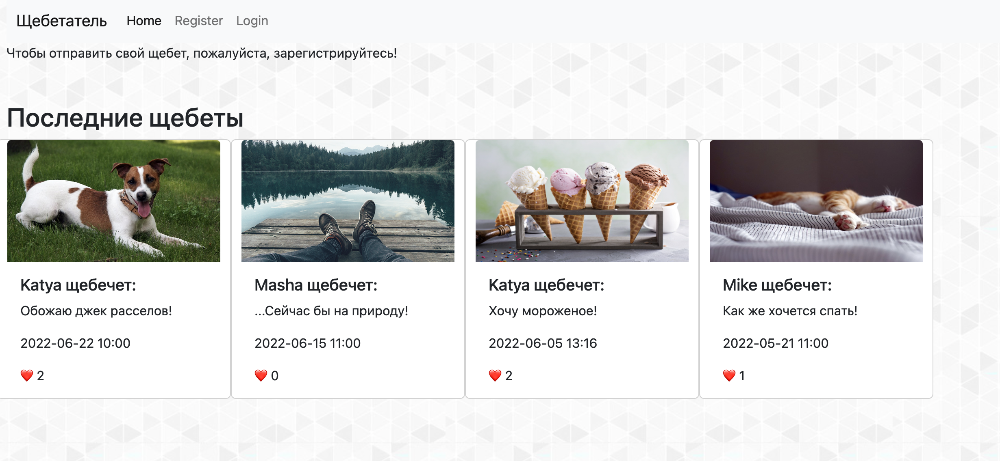
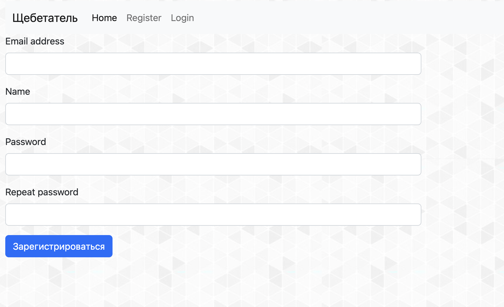
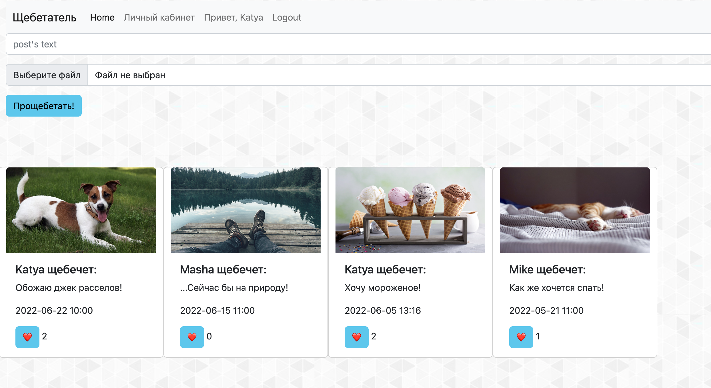
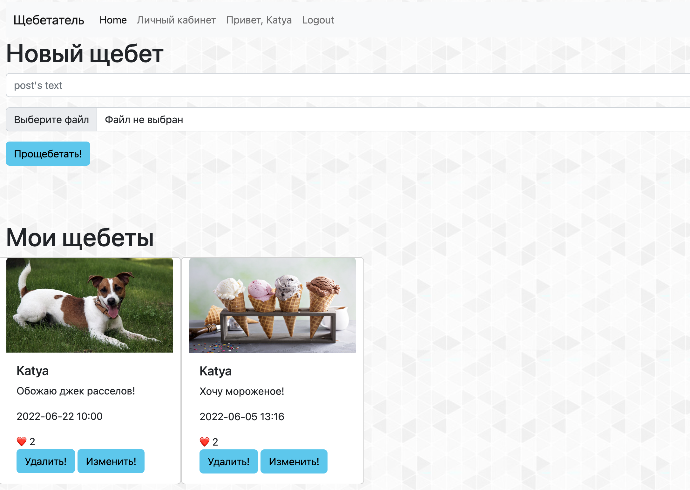

Я создала уникальный сервис - "Щебетатель".
Щебет - это короткое текстовое сообщение с картинкой. Пользователи будут 
оставлять такие сообщения и лайкать сообщения других пользователей.

Если пользователь не аутентифицирован, он увидит перед собой главную страницу.

На ней будет список последних щебетов. Каждый щебет состоит из:
* Картинки
* Даты отправки
* Имени отправителя
* Текста сообщения
* Количества лайков

В навбаре есть заголовок, который переводит на главную страницу, а также 
ссылки на `Вход` и `Регистрацию`.

После успешного входа главная страница немного изменяется. 
Кроме того, пользователь может добавить свой собственный щебет, а также лайкнуть щебеты.

В личном кабинете пользователя предусмотрен функционал добавления нового щебета, просмотрфвсе собственных щебетов, а также удаления и редактирования любого из них.

